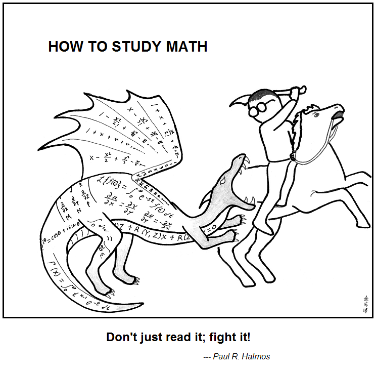
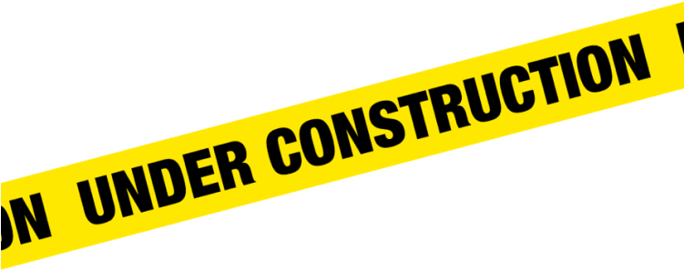

[{: style="float: right; width: 25%;"}](https://github.com/s-macke/Abstruse-Goose-Archive/blob/master/comics/353.md)
<figure>
  <blockquote>
    It’s been said before and often, but it cannot be overemphasized: study actively. Don't just read it; fight it! Ask your own questions, look for your own examples, discover your own proofs. Is the hypothesis necessary? Is the converse true? What happens in the classical special case? What about the degenerate cases? Where does the proof use the hypothesis?
  </blockquote>
    <figcaption>From <cite><a href="https://www.ams.org/notices/201106/rtx110600810p.pdf">I want to be a Mathematician</a></cite>, by Paul Halmos</figcaption>
</figure>

<figure>
  <blockquote>
    <b>How to read a mathematics book</b>    
    Reading a mathematics book is an active process. You should have paper and a pencil handy as you read. Work out the examples and create examples of your own. Before you read the proofs of the theorems in this book, try to write your own proof. Then, if you get stuck, read the proof in the book.  
    One of the marvelous features of mathematics is that you need not (perhaps, should not!) trust the author. If a physics book refers to an experimental result, it might be difficult or prohibitively expensive for you to do the experiment yourself. If a history book describes some events, it might be highly impractical to find the original sources (which may be in a language you do not understand). But with mathematics, all is before you to verify. Have a reasonable attitude of doubt as you read; demand of yourself to verify the material presented. Mathematics is not so much about the truths it espouses but about how those truths are established. Be an active participant in the process.
  </blockquote>
    <figcaption>From <cite><a href="https://www.ams.jhu.edu/ers/books/mathematics-a-discrete-introduction/">Mathematics, a Discrete Introduction</a></cite>, by Edward R. Scheinerman</figcaption>
</figure>

## Learning mathematics

[The Language and Grammar of Mathematics](https://www.dpmms.cam.ac.uk/~wtg10/grammar.pdf) by Timothy Gowers

## Writing mathematics

Some [common pitfalls](https://www.jmilne.org/math/words.html) when writing mathematics, by J. S. Milne

<!--
### LaTeX (and friends)

## Galois Theory

## Linear Algebra
-->

